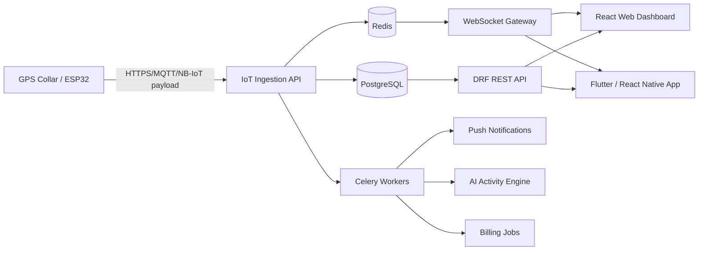
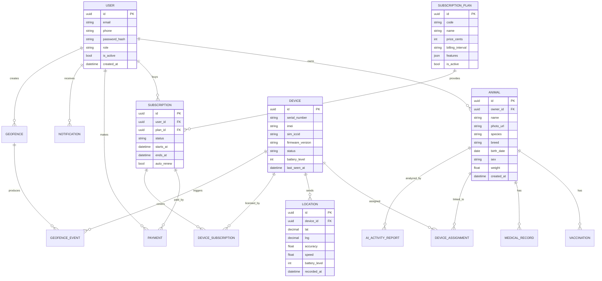
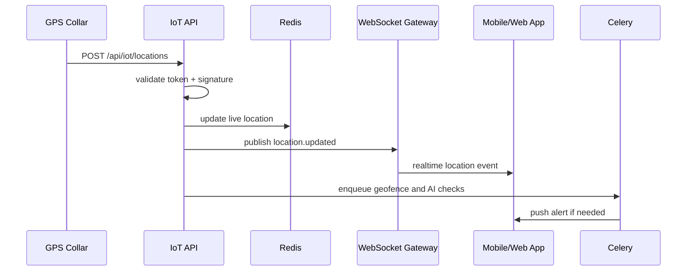
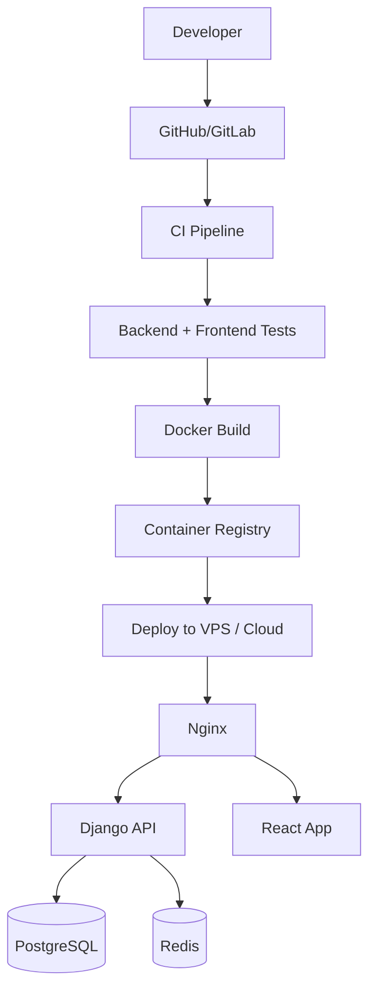

# PetTrack OS

Современная SaaS + IoT платформа для отслеживания животных через умные GPS-ошейники.

## 1. Видение продукта

PetTrack OS - коммерческая PetTech-платформа, которая объединяет умный GPS-ошейник, мобильное приложение, веб-панель, подписочную монетизацию и AI-аналитику поведения животных.

Продукт решает три главные задачи:

- владелец всегда знает, где находится животное;
- система предупреждает о рисках: выход из геозоны, низкий заряд, потеря связи, подозрительное поведение;
- бизнес или ферма могут управлять десятками и сотнями животных через единую панель.

Целевая аудитория:

- владельцы собак и кошек;
- питомники и заводчики;
- фермерские хозяйства;
- службы безопасности, кинологические центры, конные клубы;
- ветеринарные и страховые партнеры.

## 2. Основной функционал

### Для владельца

- GPS-отслеживание в реальном времени.
- Карта с животными и статусами ошейников.
- История маршрутов за день, неделю, месяц.
- Геозоны: дом, двор, ферма, парк, опасные зоны.
- Push-уведомления при выходе из геозоны.
- Уведомления о низком заряде.
- SOS / режим поиска с повышенной частотой отправки координат.
- Онлайн / оффлайн статус устройства.
- Подключение нескольких животных к одному аккаунту.
- Профиль животного: имя, фото, возраст, порода, вакцинации, медицинские заметки.
- Управление подпиской и оплатой.

### Для администратора

- Управление пользователями.
- Управление устройствами и их блокировка.
- Просмотр активных подписок.
- Настройка тарифов.
- Системная статистика: DAU, MAU, активные устройства, retention, churn.
- Поддержка пользователей и диагностика устройств.

### Для Super Admin

- Полный контроль платформы.
- Управление администраторами.
- Финансовая аналитика.
- Мониторинг серверов, очередей, WebSocket-шлюзов и IoT-трафика.
- Аудит действий администраторов.
- Управление глобальными системными настройками.

## 3. Продуктовая структура



## 4. Высокоуровневая архитектура

### Backend

- Django как основной сервер приложения.
- Django REST Framework для REST API.
- PostgreSQL для пользователей, животных, устройств, подписок, платежей и истории.
- Redis для кэша, realtime-статусов, очередей и rate limiting.
- Celery для фоновых задач.
- Django Channels или отдельный ASGI-сервис для WebSocket.
- JWT Authentication для мобильного приложения и веб-панели.
- Gunicorn для WSGI, Uvicorn/Daphne для ASGI.
- Nginx как reverse proxy и TLS termination.

### Frontend

- React + TypeScript.
- TailwindCSS.
- Leaflet или Google Maps API.
- Role-based dashboard.
- Темная минималистичная SaaS-стилистика.

### Mobile

Рекомендуемый вариант: Flutter.

Причины:

- единая кодовая база для iOS и Android;
- хорошая производительность;
- удобная работа с картами, push-уведомлениями и offline-состояниями;
- быстрее вывести MVP на рынок.

### IoT

- ESP32 как контроллер.
- GPS-модуль: NEO-6M, NEO-M8N или более точный LTE/GNSS-модуль.
- GSM/LTE-модуль: SIM7600, SIM7000, A7670 или аналог.
- SIM-карта с IoT-тарифом.
- Аккумулятор 1000-3000 mAh.
- Зарядка USB-C / pogo pins.
- Корпус IP67.
- BLE для локальной настройки устройства.

## 5. Поток данных от ошейника

1. Устройство просыпается по расписанию или событию.
2. Считывает GPS-координаты.
3. Проверяет заряд, температуру, качество сигнала, состояние SIM.
4. Формирует payload.
5. Отправляет данные на backend через HTTPS или MQTT.
6. Backend валидирует device token и подпись.
7. Последняя координата сохраняется в Redis.
8. История перемещений пишется в PostgreSQL.
9. WebSocket отправляет обновление активным клиентам.
10. Celery проверяет геозоны, заряд, оффлайн-статус и AI-события.

Пример payload:

```json
{
  "device_id": "COLLAR-8F2A91",
  "timestamp": "2026-06-09T12:10:25Z",
  "lat": 42.8746,
  "lng": 74.5698,
  "accuracy": 7.5,
  "speed": 1.8,
  "altitude": 765.2,
  "battery": 72,
  "signal": -83,
  "mode": "normal",
  "firmware": "1.4.2",
  "nonce": "c5b79a9e",
  "signature": "hmac_sha256..."
}
```

## 6. Режимы работы устройства

| Режим | Частота отправки | Назначение |
|---|---:|---|
| Standby | 10-30 минут | Экономия батареи |
| Normal | 1-5 минут | Обычное отслеживание |
| Walk | 15-60 секунд | Прогулка |
| SOS / Search | 5-10 секунд | Поиск потерянного животного |
| Offline Buffer | локальная запись | Нет сети, данные отправятся позже |

## 7. База данных

### Основные таблицы

- users
- user_profiles
- admin_profiles
- animals
- animal_medical_records
- vaccinations
- devices
- device_assignments
- locations
- geofences
- geofence_events
- notifications
- notification_settings
- subscription_plans
- subscriptions
- payments
- invoices
- device_subscriptions
- ai_activity_reports
- audit_logs

### ERD



## 8. Backend-модули

```text
backend/
  apps/
    accounts/
    animals/
    devices/
    tracking/
    geofences/
    notifications/
    billing/
    admin_panel/
    ai/
    audit/
    integrations/
  config/
    settings/
    urls.py
    asgi.py
    celery.py
```

### Модули

- accounts: регистрация, JWT, роли, профили.
- animals: карточки животных, фото, медицинская информация.
- devices: регистрация ошейников, привязка, диагностика, блокировки.
- tracking: прием координат, история, realtime-локации.
- geofences: зоны, события входа/выхода.
- notifications: push, email, SMS, in-app.
- billing: тарифы, подписки, платежи, автопродление.
- admin_panel: статистика и операционное управление.
- ai: анализ активности и поведения.
- audit: журналы действий администраторов.
- integrations: платежные системы, карты, push-провайдеры.

## 9. API endpoints

### Auth

| Method | Endpoint | Описание |
|---|---|---|
| POST | /api/auth/register/ | Регистрация |
| POST | /api/auth/login/ | Получение JWT |
| POST | /api/auth/refresh/ | Обновление токена |
| POST | /api/auth/logout/ | Выход |
| GET | /api/auth/me/ | Текущий пользователь |

### Animals

| Method | Endpoint | Описание |
|---|---|---|
| GET | /api/animals/ | Список животных |
| POST | /api/animals/ | Создать профиль |
| GET | /api/animals/{id}/ | Детали животного |
| PATCH | /api/animals/{id}/ | Обновить профиль |
| DELETE | /api/animals/{id}/ | Удалить |
| GET | /api/animals/{id}/medical/ | Медицинская информация |
| POST | /api/animals/{id}/vaccinations/ | Добавить вакцинацию |

### Devices

| Method | Endpoint | Описание |
|---|---|---|
| POST | /api/devices/claim/ | Привязать ошейник |
| GET | /api/devices/ | Устройства пользователя |
| GET | /api/devices/{id}/status/ | Статус устройства |
| PATCH | /api/devices/{id}/mode/ | Сменить режим |
| POST | /api/devices/{id}/sos/ | Включить режим поиска |
| POST | /api/devices/{id}/release/ | Отвязать устройство |

### Tracking

| Method | Endpoint | Описание |
|---|---|---|
| GET | /api/tracking/live/ | Последние координаты всех животных |
| GET | /api/tracking/animals/{id}/history/ | История перемещений |
| GET | /api/tracking/animals/{id}/route/ | Маршрут за период |
| POST | /api/iot/locations/ | Прием координат от устройства |

### Geofences

| Method | Endpoint | Описание |
|---|---|---|
| GET | /api/geofences/ | Список геозон |
| POST | /api/geofences/ | Создать геозону |
| PATCH | /api/geofences/{id}/ | Обновить |
| DELETE | /api/geofences/{id}/ | Удалить |
| GET | /api/geofences/events/ | История событий |

### Billing

| Method | Endpoint | Описание |
|---|---|---|
| GET | /api/billing/plans/ | Тарифы |
| POST | /api/billing/checkout/ | Создать оплату |
| GET | /api/billing/subscriptions/ | Подписки пользователя |
| PATCH | /api/billing/subscriptions/{id}/ | Обновить автопродление |
| POST | /api/billing/webhooks/payment/ | Webhook платежной системы |

### Admin

| Method | Endpoint | Описание |
|---|---|---|
| GET | /api/admin/users/ | Пользователи |
| PATCH | /api/admin/users/{id}/block/ | Блокировка пользователя |
| GET | /api/admin/devices/ | Все устройства |
| PATCH | /api/admin/devices/{id}/block/ | Блокировка устройства |
| GET | /api/admin/subscriptions/ | Активные подписки |
| GET | /api/admin/analytics/overview/ | Общая аналитика |

## 10. WebSocket

### URL

```text
wss://api.pettrack.example/ws/tracking/?token=<jwt>
```

### Каналы

- user:{user_id}:locations
- user:{user_id}:alerts
- device:{device_id}:status
- admin:devices
- super_admin:system

### Сообщение о локации

```json
{
  "type": "location.updated",
  "animal_id": "a9c2...",
  "device_id": "d71b...",
  "lat": 42.8746,
  "lng": 74.5698,
  "battery": 72,
  "online": true,
  "recorded_at": "2026-06-09T12:10:25Z"
}
```

### Схема realtime-потока



## 11. Система подписок

### Тарифы

| Тариф | Цена | Для кого | Возможности |
|---|---:|---|---|
| Free | $0 | Тест продукта | 1 животное, задержка обновления, история 24 часа, без SOS |
| Premium | $7.99/мес | Владельцы питомцев | realtime, SOS, геозоны, история 30 дней, AI-отчеты |
| Family | $14.99/мес | Несколько животных | до 5 животных, расширенные уведомления, история 90 дней |
| Business / Farm | от $49/мес | Фермы и питомники | до 100+ устройств, роли команды, экспорт, SLA, аналитика |

### Правила монетизации

- Подписка привязывается к устройству.
- Пользователь может иметь несколько подписок на разные ошейники.
- При отсутствии активной подписки устройство остается видимым, но функции ограничены.
- Автопродление включается при оплате, пользователь может отключить его.
- Платежи проходят через банковские карты.
- Payment webhooks обновляют статус подписки.
- При просрочке оплаты включается grace period 3-7 дней.

### Ограничения без подписки

- частота обновления координат снижена;
- история маршрутов ограничена;
- недоступен SOS;
- недоступно больше одной геозоны;
- AI-аналитика отключена;
- push-уведомления ограничены критическими событиями.

## 12. UI/UX концепция

### Визуальный стиль

- Темная тема.
- Черный / графитовый фон.
- Акцентные цвета: electric blue, mint green, signal amber, critical red.
- Много воздуха, крупная карта, аккуратные панели.
- Стиль: Tesla / Apple / modern SaaS dashboard.
- Карточки с радиусом 6-8px.
- Минимум декоративности, максимум ясности.

### Веб-панель владельца

Первый экран:

- полноэкранная карта;
- левый сайдбар со списком животных;
- верхняя панель: поиск, уведомления, профиль;
- нижняя/правая панель выбранного животного: заряд, статус, режим, скорость, последнее обновление;
- кнопка SOS как отдельное критическое действие.

Ключевые экраны:

- Map Live
- Animal Profile
- Movement History
- Geofences
- Notifications
- Subscription & Billing
- Settings

### Админ-панель

Ключевые виджеты:

- активные устройства;
- устройства оффлайн;
- новые пользователи;
- активные подписки;
- MRR / ARR;
- платежные ошибки;
- последние инциденты;
- карта плотности устройств.

### Mobile UX

Основные экраны:

- Home Map
- Pet Detail
- Search Mode
- Safe Zones
- Walk Stats
- Health Profile
- Subscription
- Alerts

Мобильное приложение должно быть максимально быстрым: открыть приложение, увидеть питомца, нажать SOS, получить маршрут к последней точке.

## 13. AI-функции

### Анализ активности

Система собирает:

- расстояние за день;
- время в движении;
- среднюю скорость;
- количество прогулок;
- периоды отдыха;
- повторяющиеся маршруты;
- аномальные остановки.

### Определение необычного поведения

AI-модуль может выявлять:

- животное двигается слишком мало;
- необычно высокая активность ночью;
- резкое отклонение от привычного маршрута;
- долгое пребывание в неизвестной зоне;
- снижение активности после вакцинации или болезни;
- возможный побег или потеря.

### Отчеты

Premium-пользователь получает:

- daily activity score;
- weekly walk summary;
- сравнение с прошлой неделей;
- предупреждения о возможных проблемах;
- рекомендации: больше прогулок, проверить заряд, обновить геозону.

## 14. Безопасность

### Пользовательские данные

- JWT access + refresh tokens.
- Хранение паролей через Django hashers.
- 2FA для администраторов.
- RBAC по ролям: User, Admin, Super Admin.
- Row-level authorization: пользователь видит только своих животных и устройства.
- Шифрование чувствительных данных.
- HTTPS-only.
- CORS whitelist.
- Rate limiting на auth и IoT endpoints.

### IoT-безопасность

- Уникальный device token.
- HMAC-подпись payload.
- Защита от replay attack через nonce + timestamp.
- Блокировка украденных или подозрительных устройств.
- OTA-обновления прошивки с подписью.
- Ограничение частоты отправки координат.

### Административная безопасность

- Audit logs для всех действий.
- Разделение прав администратора и Super Admin.
- IP allowlist для критичных действий.
- Подтверждение финансовых и системных операций.

## 15. Масштабирование

### MVP

- 1 Django API instance.
- PostgreSQL.
- Redis.
- Celery worker.
- Nginx + Gunicorn.
- Один WebSocket ASGI instance.
- VPS / небольшой cloud server.

### Growth stage

- Разделение REST API и WebSocket gateway.
- Горизонтальное масштабирование Celery.
- Redis Cluster.
- Read replicas PostgreSQL.
- Очередь Kafka или RabbitMQ для IoT ingestion.
- Отдельный сервис аналитики.
- CDN для медиа.
- Object storage для фото животных.

### Enterprise / Farm

- Multi-tenant архитектура.
- Изоляция организаций.
- SSO.
- SLA monitoring.
- Device fleet management.
- Отдельные лимиты и тарифы по контракту.

## 16. CI/CD и инфраструктура



Рекомендуемые окружения:

- local
- staging
- production

Мониторинг:

- Sentry для ошибок.
- Prometheus + Grafana для метрик.
- Loki или ELK для логов.
- Uptime checks.
- Alertmanager / Telegram / Slack alerts.

## 17. MVP roadmap

### Этап 1: Product Foundation

- Регистрация и авторизация.
- Профили животных.
- Регистрация устройств.
- Прием координат.
- Карта с последней позицией.
- Базовая история маршрутов.

### Этап 2: Realtime & Alerts

- WebSocket.
- Онлайн / оффлайн статусы.
- Геозоны.
- Push-уведомления.
- SOS-режим.

### Этап 3: Billing

- Тарифы.
- Checkout.
- Автопродление.
- Ограничение функций.
- Админка подписок.

### Этап 4: Admin & Operations

- Управление пользователями.
- Управление устройствами.
- Статистика.
- Блокировки.
- Audit logs.

### Этап 5: AI & Scale

- AI-отчеты.
- Аномалии активности.
- Расширенная аналитика.
- Business / Farm функционал.

## 18. Инвесторское позиционирование

PetTrack OS - это не просто GPS-ошейник, а подписочная операционная система для безопасности и здоровья животных.

Преимущества:

- recurring revenue через подписки;
- hardware + SaaS модель;
- расширение на B2B/Farm сегмент;
- накопление поведенческих данных;
- потенциальные партнерства с ветеринарными клиниками, страховщиками и питомниками;
- высокая эмоциональная ценность для владельца.

Ключевые метрики:

- количество активных устройств;
- MRR / ARR;
- churn;
- ARPU;
- LTV/CAC;
- средняя частота использования приложения;
- процент устройств с активной подпиской;
- количество предотвращенных потерянных животных.

## 19. Названия бренда

Возможные названия:

- PetTrack OS
- CollarOne
- PawSignal
- LumaPet
- TraceTail
- HaloPet
- GuardPaw

Рекомендуемое позиционирование:

> Premium GPS safety platform for pets and animal fleets.

## 20. Итоговый образ продукта

PetTrack OS должен ощущаться как надежная, дорогая и технологичная система:

- владелец видит питомца на карте без лишних действий;
- ошейник работает автономно и экономит заряд;
- подписка открывает реальные ценности, а не искусственные ограничения;
- администраторы видят состояние бизнеса и устройств;
- AI превращает координаты в полезные выводы о здоровье и поведении;
- архитектура готова к масштабированию от MVP до международной платформы.
